## Summary of Products
- Outdoor & Industrial Lightning Fixtures
- Power, Instrumentation & Control Cables
- Fire Resistant & Flame Retardant Cables 
- Power Distribution & Telecommunication Poles and Accessories 
- Fibre Optic Cables, Termination Box and Accessories
- Multicore Cables
- Leaky Cables & Connectors
- Solar Cables & Accessories
- Thermocouple Extension Cables
- Shipboard & Marine Cables
- Data Cables and Electronic Cables
- Cabtire Cables (Flexible Cables for Crane)
- Cable Glands, Cable Cleat, Joints, Termination Kits and Accessories
- Cable Trays, Ladders & Support System
- Lightings for Commercial, Industrial and Hazardous Application 
- Transformers, Switchgears, & Low Voltage Components 
- Lightning Protection 

## Lightning Fixtures

### Sport Light Series

<table>
<thead>
    <tr>
    <th>Product</th>
    <th>Picture</th>
    </tr>
</thead>
<tbody>
    <tr>
        <td>Sport Light N Series</td>
        <td></td>
    </tr>
    <tr>
        <td>Sport Light J Series</td>
        <td></td>
    </tr>
    <tr>
        <td>Sport Light M Series</td>
        <td></td>
    </tr>
</tbody>
</table>

### Venas Series

<table>
    <tr>
        <td></td>
        <td></td>
        <td></td>
        <td></td>
    </tr>
</table>

<table>
<thead>
    <tr>
    <th>Product</th>
    <th>Picture</th>
    <th>Ex Protection</th>
    <th>Ex Rating</th>
    </tr>
</thead>
<tbody>
    <tr>
        <td>Flood Light A</td>
        <td>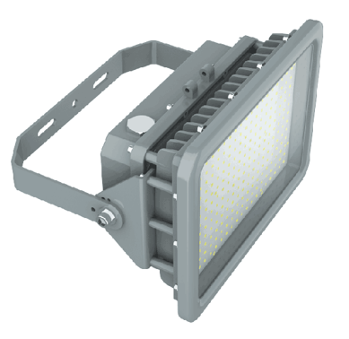</td>
        <td>Ex eb tb</td>
        <td>Zone 1&2, 21&22  (IECEx & ATEX)</td>
    </tr>
    <tr>
        <td>High Bay B</td>
        <td>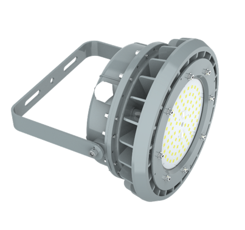</td>
        <td>Ex eb tb</td>
        <td>Zone 1&2, 21&22  (IECEx & ATEX)</td>
    </tr>
    <tr>
        <td>Bulkhead STA4</td>
        <td>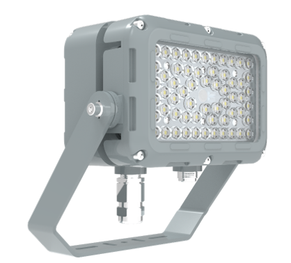</td>
        <td>Exe</td>
        <td>Zone 1&2, 21&22  (IECEx & ATEX)</td>
    </tr>
    <tr>
        <td>Batten R</td>
        <td>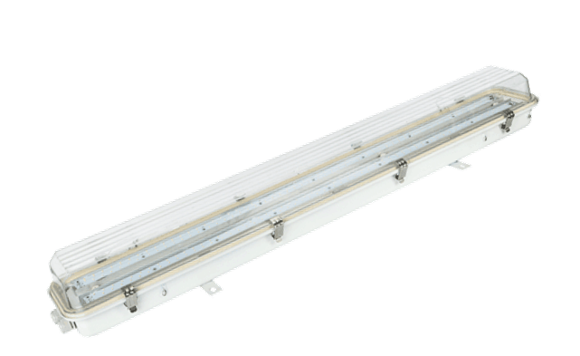</td>
        <td>Ex db eb mb</td>
        <td>Zone 1&2, 21&22  (IECEx & ATEX)</td>
    </tr>
    <tr>
        <td>Street Lamp STA1&2</td>
        <td>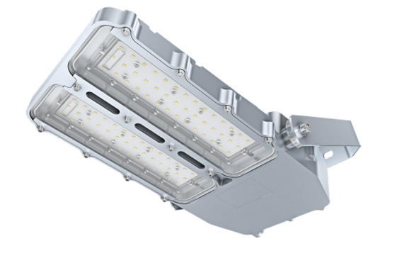</td>
        <td>Ex eb mb</td>
        <td>Zone 1&2, 21&22  (IECEx & ATEX)</td>
    </tr>
</tbody>
</table>

## Power Cables

### High, Medium Voltage Cables

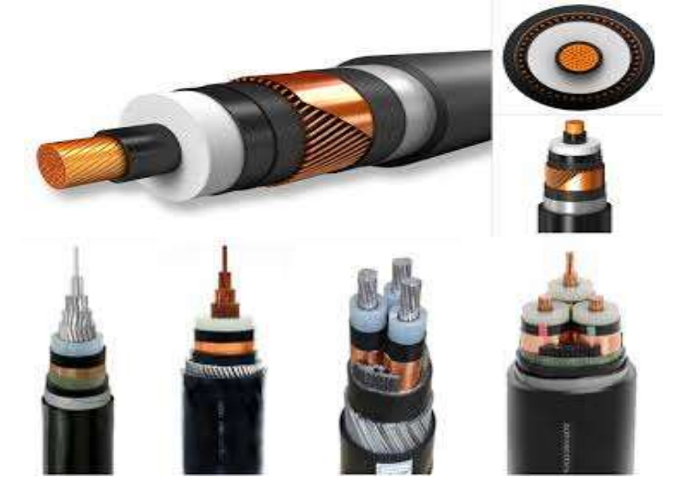

### Low Voltage Cables

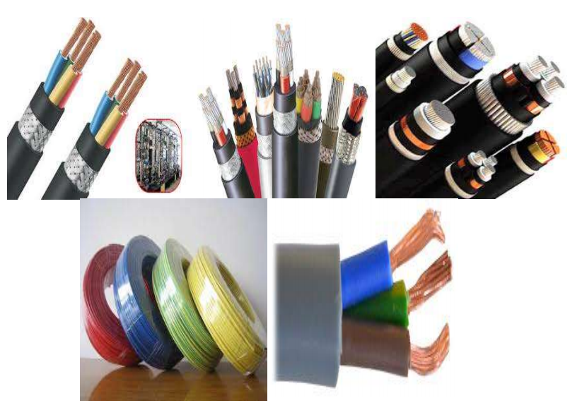

### Fire Resistant Cables

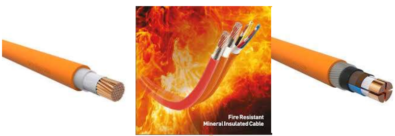

### Instrumentation Cables

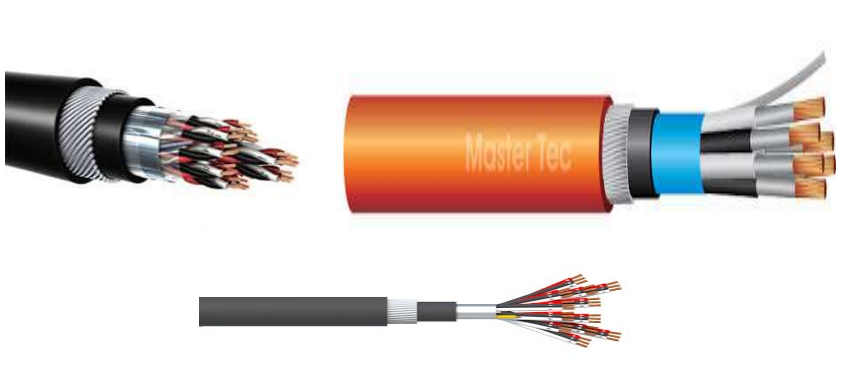

### Solar Cables & Accessories

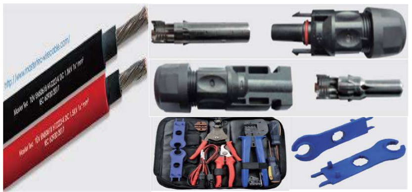

---

## Accessories

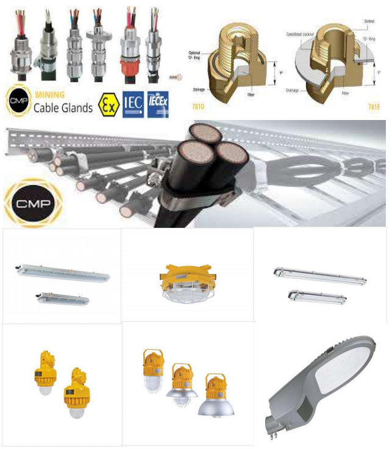

---

## Fibers & Accessories

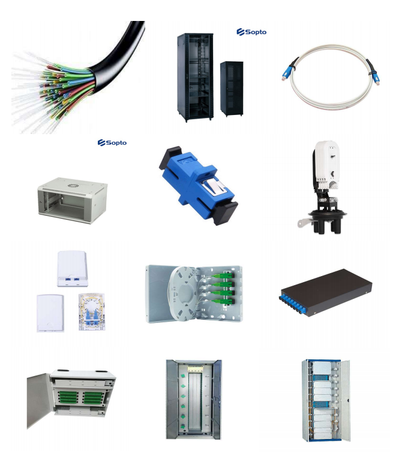

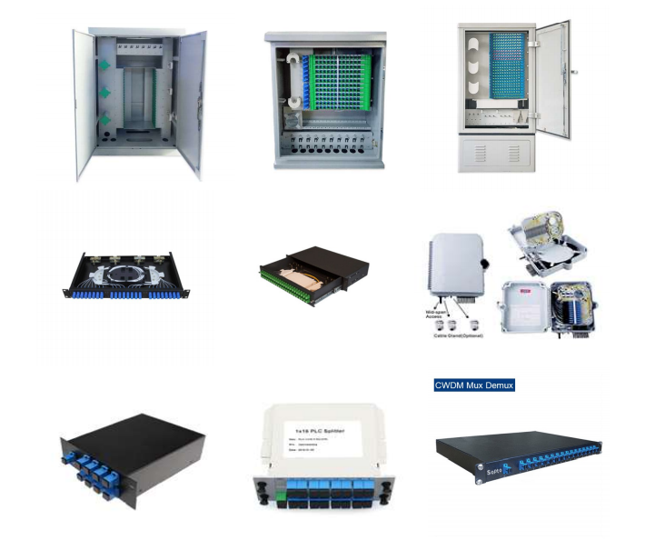

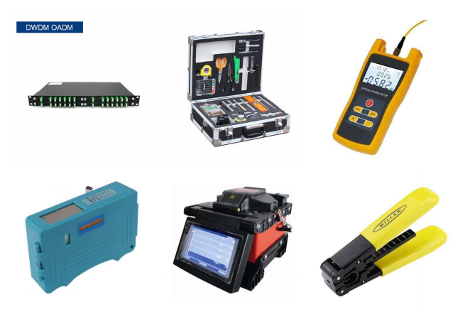